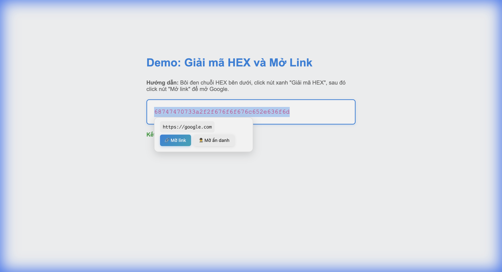

# Công cụ Giải mã HEX sang Text dành cho member NVH2VN

Extension Chrome giúp bạn giải mã chuỗi hexadecimal thành văn bản một cách nhanh chóng và tiện lợi.

## Demo



*Bôi đen HEX → Click "Giải mã HEX" → Kết quả hiện với nút mở link*

## Tại sao cần công cụ này?

Khi làm việc với dữ liệu, đôi khi bạn gặp phải các chuỗi được mã hóa dưới dạng hexadecimal. Việc giải mã thủ công rất mất thời gian. Extension này sinh ra để giải quyết vấn đề đó - chỉ cần bôi đen và click, bạn sẽ có kết quả ngay lập tức.

## Cài đặt

Extension này chưa được publish lên Chrome Web Store, nên bạn cần cài đặt thủ công:

1. Tải project về máy (hoặc clone repository)
2. Mở Chrome và truy cập `chrome://extensions/`
3. Bật chế độ Developer (góc trên bên phải)
4. Click "Load unpacked" (Tải tiện ích đã giải nén)
5. Chọn thư mục chứa extension này
6. Xong! Extension đã sẵn sàng sử dụng

Nếu bạn muốn dùng chế độ ẩn danh:
- Vào `chrome://extensions/`
- Tìm extension này
- Click "Details" (Chi tiết)
- Bật "Allow in incognito" (Cho phép trong chế độ ẩn danh)

## Cách sử dụng

Extension hỗ trợ 3 cách giải mã khác nhau, tùy vào tình huống của bạn:

### Cách 1: Bôi đen và click (Inline Mode)

Đây là cách nhanh nhất khi bạn đang đọc một trang web:

1. Bôi đen chuỗi HEX bất kỳ trên trang
2. Một nút nhỏ màu xanh sẽ xuất hiện bên dưới
3. Click vào nút đó
4. Kết quả giải mã sẽ hiện ra ngay

Nếu kết quả là một URL, bạn sẽ thấy thêm 2 nút:
- "Mở link": Mở URL trong tab mới
- "Mở ẩn danh": Mở URL trong cửa sổ ẩn danh


*Khi giải mã URL, extension tự động hiện nút mở link*

### Cách 2: Dùng popup

Phù hợp khi bạn có sẵn chuỗi HEX cần giải mã:

1. Click vào icon extension trên thanh công cụ
2. Dán chuỗi HEX vào ô
3. Click "Giải mã" hoặc nhấn Ctrl+Enter
4. Kết quả sẽ hiển thị ngay bên dưới

Bạn có thể:
- Sao chép kết quả bằng nút "Sao chép"
- Mở URL (nếu kết quả là link) bằng các nút tương ứng

### Cách 3: Menu chuột phải

Cách này tiện khi đã bôi đen văn bản sẵn:

1. Bôi đen chuỗi HEX
2. Click chuột phải
3. Chọn "Giải mã HEX"
4. Kết quả sẽ hiện trong popup

Nếu văn bản không phải HEX hợp lệ, extension sẽ thông báo lỗi.

## Ví dụ sử dụng

Bạn có thể thử ngay với những chuỗi sau:

**Văn bản đơn giản:**
```
48656c6c6f20576f726c64
```
Kết quả: `Hello World`

**Tiếng Việt:**
```
5869e1baa720636861cc8820566965cc82744e616d
```
Kết quả: `Xin chào Việt Nam`

**URL:**
```
68747470733a2f2f676f6f676c652e636f6d
```
Kết quả: `https://google.com` (có thể click để mở)

**HEX có khoảng trắng:**
```
48 65 6c 6c 6f
```
Kết quả: `Hello` (khoảng trắng được tự động bỏ qua)

## Lưu ý

- Extension chỉ xử lý dữ liệu trên máy bạn, không gửi bất kỳ thông tin nào ra ngoài
- Hỗ trợ cả ASCII và UTF-8
- Tự động bỏ qua khoảng trắng và ký tự xuống dòng trong chuỗi HEX
- Popup sẽ tự động đóng khi bạn click ra ngoài hoặc scroll trang
- Nếu HEX không hợp lệ, extension sẽ hiển thị thông báo lỗi màu đỏ

## Xử lý sự cố

**Inline mode không hoạt động:**
- Đảm bảo văn bản bôi đen là HEX hợp lệ (chỉ chứa 0-9, a-f, A-F)
- Thử reload lại trang
- Kiểm tra console xem có lỗi không (F12)

**Nút mở link không hoạt động:**
- Kiểm tra popup blocker của trình duyệt
- Thử reload extension tại `chrome://extensions/`

**Menu chuột phải không hiện:**
- Đảm bảo đã bôi đen văn bản trước
- Thử reload extension

**Chế độ ẩn danh không hoạt động:**
- Vào `chrome://extensions/`
- Tìm extension
- Bật "Allow in incognito"

## Kỹ thuật

Extension được xây dựng với:
- Manifest V3 (phiên bản mới nhất của Chrome Extension)
- Vanilla JavaScript (không dùng framework)
- Hỗ trợ dark mode tự động
- Xử lý hoàn toàn offline, không cần internet

## Đóng góp

Nếu bạn phát hiện lỗi hoặc muốn thêm tính năng, hãy tạo issue hoặc pull request. Mọi đóng góp đều được hoan nghênh.

## License

MIT License
